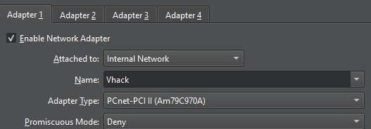
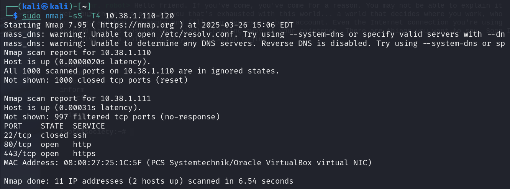

# 🏴‍☠️ My First Homelab: Kali Linux & Mr. Robot in VirtualBox  

## 🚀 Overview  
This project is my first **cybersecurity homelab** setup. I created a virtualized environment using **VirtualBox** to practice **ethical hacking** and **penetration testing** techniques.  

### 🖥️ Machines in the Lab  
- **Attacker Machine**: Kali Linux  
- **Target Machine**: Mr. Robot CTF VM  
- **Networking**: Isolated **internal network** (no internet access)  
- **IP Assignment**: DHCP within the internal network  

## ⚙️ Setup Details  

### 🔹 Virtualization  
- **Platform**: VirtualBox  
- **Operating Systems**: Kali Linux & Mr. Robot CTF VM  
- **ISO/OVA Sources**:  
  - [🔗 Kali Linux - Official Website](https://www.kali.org/)  
  - [🔗 Mr. Robot VM - VulnHub](https://www.vulnhub.com/)  

### 🔹 Network Configuration  
- **Network Type**: Internal Network (**isolated from main network**)  
- **IP Addresses**: Assigned dynamically via **DHCP**  

📸 **Screenshot - VirtualBox Network Settings:**  
  

---

## 🎯 Goals  
✅ **Scan & Enumerate** the Mr. Robot VM using **Nmap**  
✅ **Identify vulnerabilities** and exploit them  
✅ **Practice privilege escalation & web exploitation**  
✅ **Document findings and learnings**  

📸 **Screenshot - Kali Linux Nmap Scan:**  
  

---

## 🛠️ Next Steps  
1️⃣ **Perform an Nmap scan** to discover open ports  
2️⃣ **Use Dirb/Gobuster** for directory enumeration  
3️⃣ **Analyze web vulnerabilities & attempt exploits**  
4️⃣ **Document results & share insights**  

---

💡 **Excited to dive deeper into ethical hacking!** 🔥 Let’s break, learn, and secure! 🏴‍☠️  
